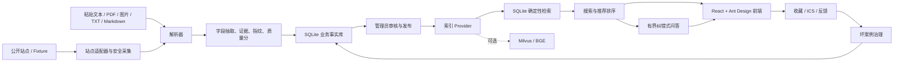

# “珞珈学术雷达”项目详尽报告

> 项目英文名：Campus Seminar Copilot  
> 项目类型：高校学术活动聚合、推荐与可溯源问答平台  
> 当前阶段：完整、可本地运行并经过自动化与浏览器验证的 MVP  
> 报告依据：仓库实际源码与 2026-08-13 本机复验结果

## 1. 项目概述

“珞珈学术雷达”面向高校师生获取学术讲座、论坛和报告信息时遇到的入口分散、通知格式不统一、检索困难、时间敏感以及信息可信度不足等问题，将分散在学院网站、活动通知、PDF、图片和人工粘贴文本中的信息，转化为可审核、可检索、可推荐、可追溯的结构化学术活动数据。

项目并非只提供一个问答页面，而是实现了完整业务闭环：

```text
站点采集 / 文本粘贴 / 文件上传
        ↓
字段解析与证据保留
        ↓
跨来源指纹去重
        ↓
草稿生成与质量评分
        ↓
管理员编辑、发布或驳回
        ↓
搜索 / 个性化推荐 / RAG 式问答
        ↓
收藏 / ICS 日历导出 / 用户反馈
        ↓
无结果与负反馈进入坏案例治理
```

该项目是对原有通用 RAG 原型的场景化重构。它保留了混合检索、增量索引、工具式问答、Corrective RAG 和 Adaptive RAG 的设计思想，但将重点从“模型演示”转向“可运行的业务系统”：增加活动状态、管理员审核、用户行为、采集记录、数据质量、失败降级和坏案例回流。

## 2. 项目解决的核心问题

### 2.1 信息来源分散

不同学院和研究机构分别发布活动，用户需要反复访问多个网站。项目为 5 个武汉大学公开站点建立独立适配器，并预留定时增量同步入口：

- 武汉大学珞珈讲坛；
- 武汉大学新闻与传播学院；
- 武汉大学经济与管理学院；
- 武汉大学数学与统计学院；
- 武汉大学质量发展战略研究院。

### 2.2 通知格式非结构化

讲座通知可能是网页、PDF、图片、Markdown、TXT 或直接粘贴的文本。系统将其解析为统一的 `Event` 数据结构，并保存字段对应的原文证据。缺失的主讲人、时间、地点和来源保持空值或显示“待补充”，不通过语言模型猜测。

### 2.3 搜索只匹配字面关键词

系统同时计算关键词相关性、确定性语义相似度和时间新鲜度，并允许加入用户兴趣与活动质量。用户既可搜索“人工智能”，也可提出“本周有哪些 AI 讲座”之类自然语言问题。

### 2.4 生成式问答可能产生幻觉

问答只使用数据库中已审核发布、质量达标且未过期的活动。答案逐条给出标题、时间、地点、主讲人和来源；无结果时明确说明，并记录为坏案例，而不是编造活动。

### 2.5 数据进入系统后缺少治理闭环

项目将解析结果先保存为草稿，由管理员补充字段并发布或驳回；搜索无结果和负反馈会进入坏案例列表，可继续处理并标记为已解决，实现从用户使用到数据质量改进的闭环。

## 3. 系统定位与完成度

项目当前可以定义为“完整 MVP”，依据如下：

- 前后端均可独立启动，首屏直接提供可操作的搜索和推荐能力；
- 采集、解析、审核、发布、检索、推荐、问答、收藏、日历、反馈和坏案例链路已经打通；
- 没有外部 API 密钥、Milvus、BGE 或外部 LLM 时仍能运行；
- 后端单元与 API 集成测试通过；
- 前端 TypeScript 检查与 Vite 生产构建通过；
- 项目技能质量门禁通过；
- 桌面与移动端界面均完成真实浏览器检查。

它尚不能定义为“生产级线上平台”，因为当前没有真实身份系统、生产级权限控制、任务调度器、消息队列、监控告警和大规模性能压测；Milvus、Embedding、LLM 与 OCR 也没有在本机默认路径中启用。

## 4. 总体架构



架构遵循两个关键原则：

1. **SQLite 是业务事实的唯一来源。** 活动审核状态、用户行为和采集记录都以关系数据库为准。
2. **检索索引是可重建的派生数据。** 即使外部向量库不可用，发布操作仍保留业务事实，并降级到本地确定性检索。

## 5. 技术栈

| 层次 | 技术 | 在项目中的用途 |
|---|---|---|
| 后端框架 | Python 3.11+、FastAPI 0.116.1 | REST API、参数校验、OpenAPI、生命周期管理 |
| 数据访问 | SQLAlchemy 2.0.43 | ORM、事务、关系约束与查询 |
| 数据库 | SQLite | 活动、用户、收藏、反馈、审核、采集和坏案例的事实库 |
| 数据校验 | Pydantic 2.11.7 | 请求/响应模型、长度、枚举和范围约束 |
| 文档解析 | pypdf、python-dateutil、正则规则 | PDF 文本抽取、日期解析和字段识别 |
| 网页采集 | httpx、BeautifulSoup | 白名单站点请求、列表与详情解析 |
| RAG 工作流 | 有界确定性 Python 工作流，借鉴 Corrective/Adaptive RAG | 时间理解、检索、无结果改写与可溯源回答 |
| 可选检索 | Milvus 2.5 Provider 边界 | 为后续 BGE、BM25、HNSW、RRF 接入预留接口 |
| 前端 | React 18.3、TypeScript 5.9、Ant Design 5.27 | 响应式业务界面与交互 |
| 构建工具 | Vite 7.3 | 开发服务器和生产构建 |
| 测试 | pytest 8.4、FastAPI TestClient | 单元测试与 API 业务流集成测试 |
| 部署 | Dockerfile、Docker Compose | 后端、前端和可选 Milvus 的容器编排 |

需要特别说明：仓库安装了 `langgraph` 依赖，但当前默认问答路径没有直接创建 LangGraph `StateGraph`，而是用普通 Python 实现有最大轮数限制的纠错循环。因此，简历中更准确的说法是“借鉴 Corrective/Adaptive RAG 设计有界问答工作流”，而不是声称已经完成完整的 LangGraph 图编排。

## 6. 后端核心实现

### 6.1 FastAPI 接口层

后端共定义 23 个 API 路由，覆盖以下领域：

| 领域 | 代表接口 | 作用 |
|---|---|---|
| 健康检查 | `GET /api/health` | 检查数据库及当前检索、Embedding、LLM Provider 配置 |
| 活动查询 | `GET /api/events`、`GET /api/events/{id}` | 分页筛选与详情读取 |
| 搜索推荐 | `POST /api/search`、`GET /api/recommend` | 排序检索和基于兴趣的推荐 |
| 问答 | `POST /api/chat` | 解析时间范围、检索和模板化可溯源回答 |
| 内容接入 | `POST /api/admin/parse-text`、`POST /api/admin/upload` | 粘贴文本或上传文件并生成草稿 |
| 审核管理 | `PATCH /api/admin/events/{id}`、发布、驳回接口 | 字段编辑、状态迁移和审核快照 |
| 用户行为 | 收藏增删查、`POST /api/feedback` | 保存兴趣信号和用户反馈 |
| 日历导出 | `GET /api/events/{id}.ics` | 生成标准 iCalendar 文件 |
| 坏案例 | 查询、新增、更新状态接口 | 质量问题闭环管理 |
| 采集管理 | 来源、运行记录、执行采集接口 | Fixture 或在线同步及单站记录 |

FastAPI 与 Pydantic 在接口边界实现了分页范围、字符串长度、状态枚举、位置模式、上传类型和上传大小等校验。异常场景返回明确的 4xx 状态码，如不支持文件类型返回 415、文件过大返回 413、发布字段不完整返回 422。

### 6.2 结构化解析

解析器负责：

- 统一空格和中文全角空格；
- 识别题目、主讲人、单位、时间、地点和主办方标签；
- 使用 `python-dateutil` 处理中文年月日与自然日期文本；
- 根据关键词推断人工智能、计算机、数学、物理、生命科学、经济管理、人文社科和地球科学等标签；
- 从“摘要、内容简介”等段落提取活动简介；
- 保存每个已识别字段对应的 `extraction_evidence`；
- 根据字段完整性计算 `extraction_confidence` 与 `quality_score`。

当前 PDF 使用 `pypdf` 提取文本，TXT/Markdown 以 UTF-8 读取。图片在未配置 OCR Provider 时只保存文件并建立“待补充”草稿，避免伪造识别结果。

### 6.3 去重策略

系统将以下信息组成稳定指纹：

```text
规范化标题 + 活动日期 + 规范化主讲人
```

随后计算 SHA-256，存入 `Event.fingerprint` 唯一索引。相同活动来自不同页面时不会覆盖已审核数据，而是把新的来源地址合并进 `extraction_evidence.duplicate_sources`。数据库唯一约束和 `IntegrityError` 回退共同处理并发写入下的重复问题。

### 6.4 质量评分与发布门槛

活动质量分由标题、时间、地点、主讲人、主办方、来源、摘要长度和领域标签共同计算；结束时间早于开始时间会扣分。公开检索要求：

- 状态为 `published`；
- 质量分不低于 0.45；
- 活动未过期，或时间确实缺失；
- 查询相关度达到最低阈值。

管理员发布时必须至少补齐时间、地点和来源，并通过质量门槛。每次发布或驳回都会写入 `AdminReview`，保存审核人、动作、备注和关键字段快照。

### 6.5 采集系统

每个公开站点使用独立 `SourceAdapter`，负责列表 URL 发现和详情页文本解析。采集安全与稳定性措施包括：

- 只允许 HTTP/HTTPS；
- 使用明确的武汉大学域名白名单；
- 拒绝回环、私网和链路本地地址，降低 SSRF 风险；
- 固定、可识别的 User-Agent；
- 可配置超时、有限重试和请求间隔；
- 每个来源独立生成 `CrawlRun`，单站失败不会阻塞其他来源；
- 每次运行记录发现、新增、重复和错误数量；
- 自动化测试完全使用本地 Fixture，不依赖实时网络。

项目准确地将该能力描述为“定时增量同步”，没有虚构成实时推送。

### 6.6 检索与推荐排序

基础排序公式为：

```text
base_score = 0.45 × semantic_score
           + 0.30 × keyword_score
           + 0.25 × time_score
```

在基础分上加入较小权重的用户兴趣和活动质量：

```text
final_score = base_score × 0.88
            + interest_score × 0.07
            + quality_score × 0.05
```

各分量含义如下：

- `semantic_score`：默认使用中文单字、二元组和英文 Token 的余弦式集合重叠作为无模型降级方案；
- `keyword_score`：标题 0.50、标签 0.23、摘要 0.19、主讲人 0.08，确保标题匹配最重要；
- `time_score`：过期活动为 0，未来活动按 `1 / (1 + days / 7)` 衰减；
- `interest_score`：用户兴趣标签与活动标签的相似度；
- `quality_score`：结构化数据的质量分。

排序结果保留全部评分分量，并通过规则生成“标题或主题与查询匹配”“内容语义相关”“符合你的兴趣领域”“活动临近”等解释，前端会直接展示这些理由和分数。

### 6.7 有界 RAG 式问答

问答流程先解析“今天、明天、本周、下周、本月”等时间表达，再检索已发布活动。如果首次没有结果，系统移除时间和问句填充词进行一次确定性改写；整个循环最多 2 轮，避免无限重试。

回答使用检索结果生成，不调用外部大模型也能工作。每条结果强制包含：

- 活动标题；
- 时间；
- 地点；
- 主讲人；
- 来源。

如果没有结果，回答会明确告知用户，并自动写入 `BadCase`。该设计的价值在于可预测、可测试和可追溯，适合先完成可靠 MVP，再逐步接入 LLM。

### 6.8 用户行为与质量回流

- 收藏表使用 `(user_id, event_id)` 唯一约束，重复收藏保持幂等；
- ICS 导出对特殊字符进行转义，只允许导出有时间的已发布活动；
- 用户可以提交 helpful、not_helpful、incorrect、missing 或 other 类型反馈；
- 负反馈会自动生成坏案例；
- 管理员可将坏案例标记为 open、resolved 或 ignored。

## 7. 数据模型

系统包含 8 个核心实体：

| 实体 | 关键字段 | 业务职责 |
|---|---|---|
| `Event` | 标题、主讲人、时间、地点、标签、摘要、来源、状态、置信度、质量分、指纹、证据 | 学术活动核心事实 |
| `User` | 用户名、角色、兴趣标签 | 用户与个性化信息 |
| `Favorite` | 用户、活动、创建时间 | 收藏关系 |
| `Feedback` | 用户、活动、反馈类型、内容 | 用户反馈 |
| `BadCase` | 查询、错误结果、预期结果、错误类型、状态 | 无结果与错误案例治理 |
| `CrawlSource` | 来源名称、入口、适配器、游标、最近成功时间 | 采集源配置 |
| `CrawlRun` | 来源、模式、状态、发现/新增/重复数量、错误 | 采集运行审计 |
| `AdminReview` | 活动、审核人、动作、备注、快照 | 审核轨迹 |

`Event.status` 使用显式状态：`draft / published / rejected / expired`。这种建模将“解析结果”和“可对外展示的信息”分开，避免低质量或未经审核的数据进入用户检索。

## 8. 前端产品设计

前端使用 React、TypeScript 与 Ant Design 构建响应式控制台，导航包含 5 个主要模块：

1. **活动探索**：自然语言搜索、日期/领域筛选、推荐卡片、问答和空结果状态；
2. **上传解析**：粘贴活动通知或拖拽上传 PDF、图片、TXT、Markdown，查看草稿和解析置信度；
3. **管理后台**：查看全部活动和待审核草稿，编辑字段，发布或驳回；
4. **采集状态**：查看 5 个来源、运行 Fixture 或在线同步、检查运行记录；
5. **坏案例管理**：查看无结果问答、错误推荐和负反馈并标记解决。

活动详情使用抽屉展示时间、地点、主讲人、单位、主办方、摘要、来源、推荐理由和语义/关键词/时间分量，并提供收藏、ICS 导出、来源跳转与反馈入口。

界面针对窄屏进行了响应式处理：侧边栏在移动端折叠，卡片网格随屏幕宽度切换列数，管理表格和表单保持可操作。首屏不是营销落地页，而是可以立即使用的搜索和推荐界面。

## 9. 安全性、可靠性与降级设计

### 9.1 已实现措施

- 上传扩展名白名单与 10 MB 默认大小限制；
- 上传文件名清洗，服务端重命名保存；
- Pydantic 请求长度、枚举、分页和数值范围校验；
- 管理接口支持 `X-Admin-Token`；
- CORS 来源可配置；
- 采集 URL 域名白名单与私网地址阻断；
- 网络请求使用超时、有限重试和节流；
- 单来源采集失败隔离；
- 数据库唯一约束保证活动指纹和收藏关系的幂等性；
- 外部索引失败不回滚已经审核的业务事实；
- 问答限制结果来源和最大纠错轮数。

### 9.2 当前边界

`ADMIN_TOKEN` 为空时，系统为方便本地演示而进入无鉴权管理员模式。若部署到共享网络或公网，必须增加真实登录、角色权限、TLS、反向代理限流、CSRF/会话策略、安全日志和密钥管理。当前 URL 白名单按主机名控制，但生产环境仍应增加 DNS 解析后 IP 复验，进一步防御 DNS Rebinding。

## 10. 测试与验证证据

2026-08-13 在本机重新执行验证，结果如下：

| 检查项 | 实测结果 | 覆盖内容 |
|---|---|---|
| Python 静态编译 | 通过 | `backend/app` 全部模块可编译 |
| pytest | **15 passed，0 failed，0 warnings，0.45s** | 解析、去重、排序、过期过滤、搜索、问答、审核、收藏、ICS、上传校验、采集与 SSRF |
| API 集成链路 | 通过 | 草稿 → 发布 → 搜索 → 问答 → 收藏 → ICS → 反馈 → 坏案例 |
| 离线排序评测 | **2/2 ordering checks passed，rate 1.0** | AI 与数学查询中相关活动排序高于无关活动 |
| 前端生产构建 | 通过 | TypeScript 编译，Vite 7.3.6，4,872 modules transformed |
| 技能质量门禁 | **ok: true，6/6** | chat、recommend、upload、ICS、admin UI、feedback UI |
| 浏览器 UI | 通过 | 桌面与 390×844 移动视口；最终控制台错误/警告为 0 |

离线评测的 1.0 只表示仓库内 2 个确定性排序样例全部通过，不能等同于真实用户环境下的检索准确率。

本次前端构建产物为：

- JavaScript：1,269.91 kB，gzip 402.41 kB；
- CSS：4.85 kB，gzip 1.70 kB；
- HTML：0.41 kB，gzip 0.31 kB。

构建成功，但 Vite 提示主 JavaScript Chunk 超过 500 kB。这是明确的后续优化项，可通过路由懒加载、组件按需拆分和 `manualChunks` 降低首屏资源体积。

## 11. 工程规模与代码组织

当前仓库约包含：

- 后端应用源码 999 行 Python；
- 后端测试 158 行 Python；
- 前端 `src` 目录 117 行 TypeScript/TSX/CSS；
- 23 个 FastAPI 路由；
- 8 个核心数据库实体；
- 5 个站点适配器与 5 份离线 Fixture；
- Docker Compose 中 backend、frontend、可选 milvus 共 3 个服务。

前端行数较少是因为多个 JSX 页面压缩在少数长行中，并不代表页面功能少；从可维护性考虑，后续应把 `App.tsx` 拆成页面、业务组件、Hooks 和类型模块。

关键目录：

```text
campus-seminar-copilot/
├─ backend/
│  ├─ app/
│  │  ├─ main.py              # API 与业务入口
│  │  ├─ models.py            # SQLAlchemy 数据模型
│  │  ├─ schemas.py           # Pydantic 输入输出模型
│  │  ├─ parser.py            # 结构化解析、指纹和质量分
│  │  ├─ crawler.py           # 站点适配器与安全采集
│  │  ├─ retrieval.py         # 检索过滤与 Provider 边界
│  │  ├─ recommendation.py    # 多分量排序和解释
│  │  ├─ workflows.py         # 有界问答工作流
│  │  ├─ services.py          # 去重写入
│  │  └─ seed.py              # 幂等演示数据
│  ├─ tests/                  # 单元与集成测试
│  └─ migrations/             # SQLite 初始迁移
├─ frontend/src/
│  ├─ App.tsx                 # 五个业务模块和交互
│  ├─ api.ts                  # API 客户端与类型
│  └─ styles.css              # 响应式视觉样式
├─ docs/                      # 架构、模型、排序、演示与报告
├─ scripts/                   # 验证与离线排序评测
└─ docker-compose.yml         # 容器编排
```

## 12. 项目难点与解决思路

### 难点一：无外部模型时仍需形成完整闭环

很多 RAG 项目在缺少 API Key、向量库或 GPU 后就无法演示。本项目把外部能力放在 Provider 边界后，默认采用 SQLite、确定性文本重叠和模板回答，保证任意开发环境都能运行核心业务。这个取舍牺牲了高级语义能力，但提高了可复现性、测试性和交付确定性。

### 难点二：处理不完整信息且不产生幻觉

解析器只提取能够在原文中找到证据的字段，并保存证据片段。缺失字段不推断；图片无 OCR 时只生成待补充草稿。发布层又增加必填字段和质量分门槛，使“机器抽取”和“对外发布”之间存在人工审核缓冲区。

### 难点三：兼顾相关性、时效性与可解释性

单纯语义相似可能把过期活动排在前面。项目显式拆分语义、关键词和时间分量，对过期活动设置时间分为 0，并在公开查询层直接过滤过去事件。分数构成和推荐理由可在前端查看，便于调试错误推荐。

### 难点四：将失败变成可治理数据

问答无结果、搜索无结果和用户负反馈不是简单丢弃，而是统一进入 `BadCase`。这为后续补数据、修解析规则、调整排序权重和构建评测集提供了数据基础。

### 难点五：采集既要可用又要安全可测

系统采用域名白名单、URL 校验、超时、有限重试、节流和单站失败隔离；同时用本地 Fixture 保证测试不依赖公网状态。这样既保留真实数据接入能力，又避免 CI 因外部网站波动而不稳定。

## 13. 与普通 RAG Demo 的区别

普通 RAG Demo 往往只有“上传文档—向量检索—大模型回答”。本项目额外实现了：

- 活动领域的结构化数据模型和状态机；
- 解析证据、质量评分与发布门槛；
- 管理员审核和审核快照；
- 时间敏感的排序与过期过滤；
- 用户兴趣、收藏和日历导出；
- 采集来源、运行审计与跨来源去重；
- 无结果与负反馈驱动的坏案例闭环；
- 无密钥、无向量库情况下的确定性降级；
- 可自动验证的 API 和业务行为。

因此，它更接近一个垂直领域 AI 应用的工程化原型，而不是孤立的模型调用示例。

## 14. 真实限制与后续演进

### 14.1 当前限制

1. 默认“语义分”是基于 Token/中文二元组重叠的确定性近似，不等同于真正的向量语义检索。
2. `MilvusIndex` 当前只实现懒连接和 Provider 边界，尚未完成 Collection Schema、BGE 向量化、BM25、HNSW、RRF 和真实查询链路。
3. 默认回答为模板化生成，外部 LLM Provider 未接入；优点是不会幻觉，缺点是表达和复杂推理能力有限。
4. 图片上传尚无 OCR，当前行为是保存文件并创建待补充草稿。
5. 工作流借鉴 Corrective/Adaptive RAG，但尚未实现真正的 LangGraph 图、节点状态和可观测轨迹。
6. 在线采集入口可用，但页面结构变化时仍需维护各站点适配器。
7. 管理员令牌只是最小保护，不是完整用户认证和 RBAC。
8. 当前 SQLite 适合单机 MVP，不适合高并发多实例写入。
9. 前端单包约 1.27 MB，尚未做页面级代码分割。
10. Docker Compose 配置已提供，但本机尚未用 Docker 实际拉取镜像和完整验证；当前验证路径是 Windows 本地进程。

### 14.2 推荐演进路线

**第一阶段：增强检索质量**

- 接入 BGE 中文 Embedding；
- 在 Milvus 中建立稠密向量、BM25 稀疏向量与 HNSW 索引；
- 使用 RRF 合并多路召回；
- 建立人工标注的查询—相关活动评测集，计算 Recall@K、MRR、nDCG。

**第二阶段：工作流与模型能力**

- 使用 LangGraph `StateGraph` 显式实现查询路由、检索、相关性判断、改写和答案校验；
- 接入可替换 LLM Provider；
- 使用结构化输出保证回答字段完整；
- 为每次问答记录检索候选、评分、节点轨迹和延迟。

**第三阶段：生产工程化**

- PostgreSQL 替代 SQLite；
- Celery/RQ 或调度平台执行异步采集和索引；
- 完成账号、RBAC、审计、限流和密钥管理；
- 增加 Prometheus 指标、链路追踪和错误告警；
- 增加缓存、分页优化、压测和灾备策略。

**第四阶段：前端与用户体验**

- 页面级懒加载和 Chunk 拆分；
- 收藏中心、个人兴趣设置和日历订阅；
- 采集/解析进度与失败详情；
- 管理端批量审核、合并重复记录和字段证据对照；
- 对推荐理由和问答引用增加更直观的可视化。

## 15. 简历写法

### 15.1 推荐项目名称

**珞珈学术雷达——高校学术活动智能推荐与可溯源问答平台**

### 15.2 推荐技术栈

`FastAPI / SQLAlchemy / SQLite / Pydantic / React / TypeScript / Ant Design / Vite / pytest / Docker Compose / RAG`

如果后续真正完成 Milvus、BGE 和 LangGraph 接入，再把它们加入核心技术栈；目前可以在“架构预留/后续演进”中介绍，不建议包装成默认已上线能力。

### 15.3 简历项目描述（详细版）

- 将通用文档 RAG 原型场景化重构为高校学术活动推荐与问答平台，使用 FastAPI、SQLAlchemy、SQLite、React、TypeScript 和 Ant Design 打通采集、解析、审核、发布、搜索、推荐、问答、收藏、ICS 导出、反馈和坏案例治理闭环。
- 设计结构化活动解析与数据质量机制，从网页、粘贴文本、PDF、TXT 和 Markdown 中提取题目、主讲人、时间、地点、主办方等字段，保存解析证据，使用 SHA-256 指纹和数据库唯一约束完成跨来源幂等去重，缺失字段保持待补充以避免数据幻觉。
- 实现可解释的多分量推荐排序，将语义相关、关键词相关和时间衰减按 0.45/0.30/0.25 融合，并加入用户兴趣与活动质量小权重；问答先解析时间范围，再执行最多两轮确定性纠错检索，只基于已发布活动生成包含时间、地点、主讲人与来源的可溯源回答。
- 为 5 个武汉大学公开站点实现独立采集适配器，加入域名白名单、SSRF 防护、超时、有限重试、节流、单站失败隔离、运行审计与离线 Fixture；支持无 API Key、无 Milvus 和无外部 LLM 的本地降级运行。
- 使用 pytest 和 FastAPI TestClient 覆盖解析、去重、排序、过期过滤、审核发布、搜索问答、收藏、ICS、上传校验和采集等行为；本机复验 15 项测试全部通过，离线排序样例 2/2 通过，前端生产构建与 6 项项目质量门禁通过。

### 15.4 简历项目描述（精简版）

- 基于 FastAPI、SQLAlchemy、SQLite、React 和 TypeScript 构建高校学术活动聚合与 RAG 式问答平台，完成采集、解析、审核、发布、检索、推荐、问答及反馈治理全链路。
- 设计“语义 0.45 + 关键词 0.30 + 时间 0.25”的可解释排序，加入过期过滤、用户兴趣和质量分，并通过有界查询改写生成只引用已发布活动的可溯源回答。
- 实现 5 个站点适配器、SSRF 白名单、增量指纹去重、上传校验、失败隔离和无密钥降级；15 项 pytest、前端生产构建和项目质量门禁全部通过。

### 15.5 一句话项目亮点

把“能回答问题的 RAG Demo”升级为“具有数据接入、人工审核、可解释排序、可信问答和质量反馈闭环的垂直领域 AI 应用 MVP”。

## 16. 面试讲解提纲

### 16.1 30 秒介绍

这个项目是一个高校学术活动聚合和问答平台。我把原来的通用 RAG 原型重构成了完整业务系统：活动可以从 5 个站点、文本或文件进入系统，经过字段抽取、去重和管理员审核后发布；用户可以搜索、获得带评分解释的推荐、询问本周或下周的活动，并收藏或导出日历。系统默认不依赖外部 API Key 和向量库，使用 SQLite 和确定性检索保证可运行，同时为 Milvus、Embedding 和 LLM 预留 Provider。项目目前有 15 项后端测试，前端构建和质量门禁均通过。

### 16.2 三分钟介绍结构

1. **背景**：高校活动信息散落在学院网站和非结构化通知中，难检索、易错过。
2. **核心链路**：采集/上传 → 解析 → 去重 → 审核 → 发布 → 搜索推荐问答 → 收藏反馈 → 坏案例。
3. **关键设计**：SQLite 作为事实源，索引可重建；默认无密钥降级；只回答已发布活动。
4. **算法**：语义、关键词、时间三分量融合，并加入兴趣与质量小权重，全部分量可解释。
5. **可靠性**：上传校验、SSRF 白名单、有限重试、单站失败隔离、幂等去重、问答最大两轮。
6. **验证**：15 项 pytest、2 个离线排序样例、前端生产构建和 6 项质量门禁通过。
7. **反思**：Milvus/BGE/LLM、真实 LangGraph、OCR 和生产级认证仍是下一阶段工作。

## 17. 高频面试问题与参考回答

### Q1：为什么使用 SQLite，而不是一开始就上 Milvus？

SQLite 保存业务事实，Milvus 只适合保存可重建的检索索引。MVP 阶段优先保证无外部依赖也能运行、测试和演示；当数据规模和语义检索需求增加后，再通过 Provider 接口接入 Milvus。这样即使向量库故障，审核发布结果也不会丢失。

### Q2：这个项目算不算真正的 RAG？

它具备 RAG 的核心结构：先解析查询和时间范围，从已审核活动中检索，再基于检索结果生成回答，并且输出来源。当前默认生成器是模板，语义分是确定性重叠降级，而不是 Embedding + LLM。因此它是可复现的 RAG 式 MVP；高级向量检索和模型生成是明确的扩展方向。

### Q3：如何避免问答幻觉？

回答输入只允许来自 `published`、质量达标且未过期的活动；模板逐条读取数据库字段，不允许补写数据库中不存在的活动；缺失字段显示“待补充”；无结果时明确回答没有找到，并记录坏案例。

### Q4：为什么排序要加入时间分？

学术活动天然具有时效性。只按文本相关度可能把内容很相关但已结束的活动排在前面，因此查询层先过滤过期活动，排序层再用时间衰减让临近活动获得更高分。

### Q5：如何保证推荐可解释？

API 返回 semantic、keyword、time、interest 和 quality 等分量，规则根据阈值生成推荐理由。前端详情页展示语义、关键词和时间分数，因此可以定位某条推荐是因为主题匹配、兴趣匹配还是活动临近。

### Q6：采集系统怎样防 SSRF？

只允许 HTTP/HTTPS 和 5 个明确域名，并拒绝回环、私网及链路本地 IP；生产环境还应在 DNS 解析后复验目标 IP，以进一步处理 DNS Rebinding。

### Q7：如何处理重复活动？

使用规范化标题、活动日期和主讲人生成 SHA-256 指纹，数据库设置唯一索引。重复来源不会覆盖原记录，而是加入证据中的来源列表；事务冲突时捕获唯一约束异常并回查已有记录。

### Q8：测试重点是什么？

测试围绕业务行为，而不是只检查函数能否调用：字段不能虚构、指纹稳定、标题权重大于摘要、过去活动不可公开检索、无结果问答要明确且记录坏案例、发布审核链路可用、ICS 格式有效、上传类型和大小受控、Fixture 采集可增量去重、危险 URL 被拒绝。

### Q9：如果继续做，你会优先改什么？

首先建立真实标注评测集，再接入 BGE + Milvus 混合检索，因为没有评测集就无法判断模型升级是否真正改善召回；随后用 LangGraph 显式实现工作流和可观测轨迹，最后补 OCR、生产身份系统、异步任务和监控。

## 18. 演示建议

一套完整演示可控制在 5～8 分钟：

1. 在活动探索页搜索“人工智能”，展示排序结果和推荐理由；
2. 提问“本周有哪些 AI 讲座”，展示时间理解和带来源回答；
3. 打开活动详情，展示分数构成、收藏、ICS 和来源；
4. 粘贴一段通知，生成草稿并展示抽取置信度；
5. 在管理后台补充字段并发布；
6. 回到探索页检索刚发布的活动；
7. 运行本地 Fixture 采集两次，展示第二次识别为重复；
8. 提问一个无结果问题，在坏案例页查看自动记录。

## 19. 运行方式

当前本机启动方式：

```powershell
cd D:\Code\RAG企业知识库项目\campus-seminar-copilot

# 后端
.\.venv\Scripts\python.exe -m uvicorn app.main:app `
  --app-dir backend --host 127.0.0.1 --port 8000

# 前端（另一个终端）
cd frontend
D:\node\npm.cmd run dev -- --host 127.0.0.1
```

- 前端：<http://127.0.0.1:5173/>
- OpenAPI：<http://127.0.0.1:8000/docs>
- 健康检查：<http://127.0.0.1:8000/api/health>

Docker Compose 也已提供：

```powershell
docker compose up --build
```

但本机尚未完成 Docker 实际运行验证，因此简历和面试中应表述为“提供 Dockerfile 与 Compose 编排”，不要表述为“已完成容器化生产部署”。

## 20. 总结

该项目最有价值的部分不只是使用了 FastAPI、React 或 RAG，而是完成了一个垂直 AI 产品从数据进入、可信治理、检索排序、用户交互到质量回流的完整闭环，并通过无密钥降级和行为级测试保证可复现。

适合在简历中突出三类能力：

- **AI 应用工程能力**：把检索、时间理解、可溯源回答和坏案例闭环组合成可用产品；
- **后端与数据建模能力**：设计状态、审核、采集、用户行为和索引边界；
- **工程质量意识**：控制幻觉、处理失败降级、实现安全校验，并用自动化测试和真实浏览器验证交付。

最准确的项目评价是：**它已经是一个功能闭环完整、可以演示和继续迭代的 MVP；距离生产级系统仍有明确且可量化的工程演进空间。**
